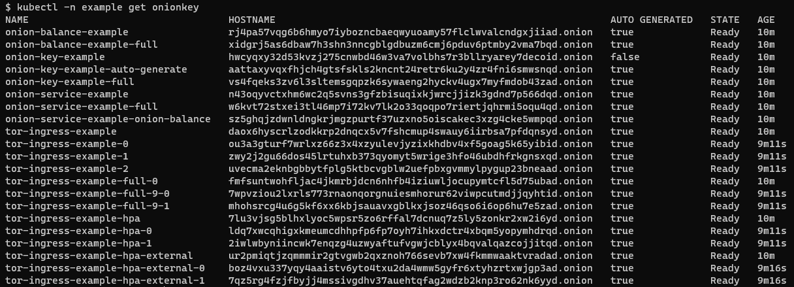

# OnionKey

An OnionKey is an abstraction of a Tor Onion Key.

A Tor Onion Key consists of the following files:

- `hostname`
- `hs_ed25519_public_key`
- `hs_ed25519_secret_key`

A user can import their existing Tor Onion Key by creating a secret.

```
 kubectl create secret generic tor-ingress-example \
   --from-file=hostname=./hostname \
   --from-file=hs_ed25519_public_key=./hs_ed25519_public_key \
   --from-file=hs_ed25519_secret_key=./hs_ed25519_secret_key
```

A user can have the Tor Operator create a new random Onion Key by using the
auto generate feature controlled by `.autoGenerate`.

## Screenshots



## Examples

### Basic

The Tor Operator will use the Onion Key provided in the `Secret`.

```
#secret.yaml

```

```
#onionkey.yaml

```

### Auto Generate

The Tor Operator will auto generated a random OnionKey and store it in a `Secret` on your behalf.

```
#onionkey.yaml

```

### Full

The Tor Operator will auto generated a random OnionKey and store it in a `Secret` on your behalf.

```
#onionkey.yaml

```

## Conditions



## Features

### Auto Generate

The Tor Operator will generate a random OnionKey and save it in the
secret specified in `.secret.name`.

- If the OnionKey's secret key is missing or malformed, the Tor Operator
  will recreate the secret key.
- If the OnionKey's public key is missing, malformed, or does not match
  the secret key, the Tor Operator will deterministically recreate the
  public key from the secret key.
- If the OnionKey's hostname is missing, malformed, or does not match
  the public key, the Tor Operator will deterministically recreate the
  hostname from the public key.

## OpenAPI Spec

```

```
