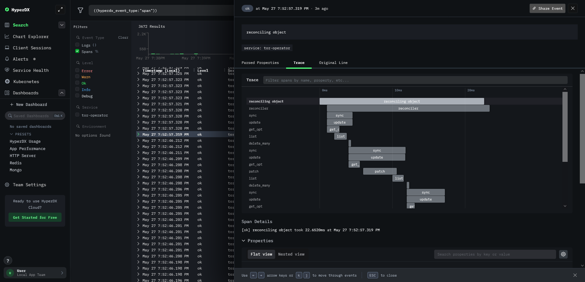

# OpenTelemetry

OpenTelemetry is configured through the [`--otel-*` CLI options](../cli.md#options), [`OTEL_* environment variables`](../cli.md#options) or the [`env` helm chart values](../helm.md#values).

## Examples

### Logs

### Metrics

### Tracing

